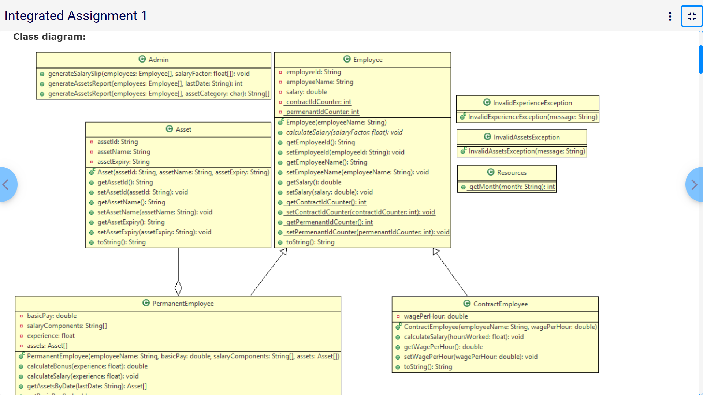

# 🛡️ Employee Asset Management System - Java
---
## 📌 Project Overview 

A robust Java-based solution designed for managing corporate assets and payroll. This project demonstrates core *Object-Oriented Programming (OOP)* principles, data validation using *Regular Expressions*, and advanced *Exception Handling*.



View the full challenge description here: 

--- 

## 🚀 Key Features
*Dynamic Payroll Calculation*: Specialized salary logic for both Permanent and Contract employees based on hours worked or experience levels.

*Asset Lifecycle Tracking*: Tracks asset allocation and identifies expiring hardware based on specific dates.

*Regex Validation*: Strict data integrity checks for Asset IDs (e.g., DSK-123456L) and Employee names.

*Custom Exception Handling*: Gracefully manages edge cases like ineligible bonuses or missing assets using custom Java exceptions.

---

## 📊 System Architecture

*Core Components*

*Employee (Abstract)*: The base class defining shared attributes and the blueprint for salary calculation.

*Admin*: The central controller responsible for generating salary slips and aggregated asset reports across the organization.

*Asset*: Manages individual hardware details and expiry logic.

*Resources*: A utility class used to convert month strings into integer values for date processing.

---

## 🛠️ Logic Implementation

*Asset Report Counting*

The system calculates expiring assets by invoking getAssetsByDate() for each permanent employee. If an employee has no valid assets for that period, an InvalidAssetsException is thrown and handled by the Admin to ensure accurate reporting.

---

## 📂 Project Structure
```
├── Assignment/
│   ├── Tester.java          # Entry point (Main)
│   ├── Employee.java        # Abstract Base Class
│   ├── Admin.java           # Reporting Logic
│   └── ... (Other Classes)
├── ClassDiagram/
│   └── classdiagram.png    # Architectural Visuals
├── .gitignore               # Keeps repo clean of .class files
└── README.md                # Project documentation
```
---

### 💻 How to Run
Navigate to the assignment folder.

Compile the files: javac *.java

Run the tester: java Tester

